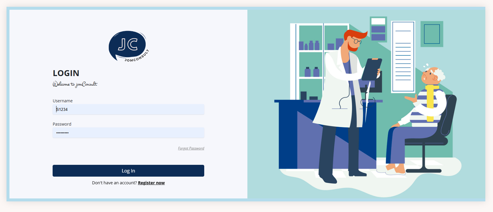
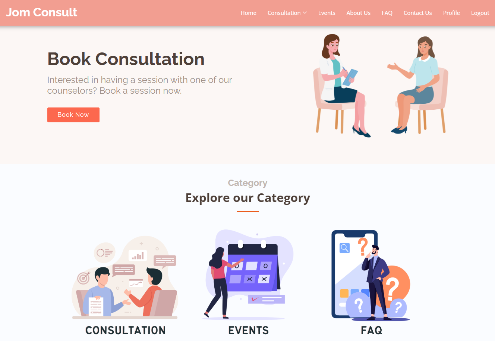
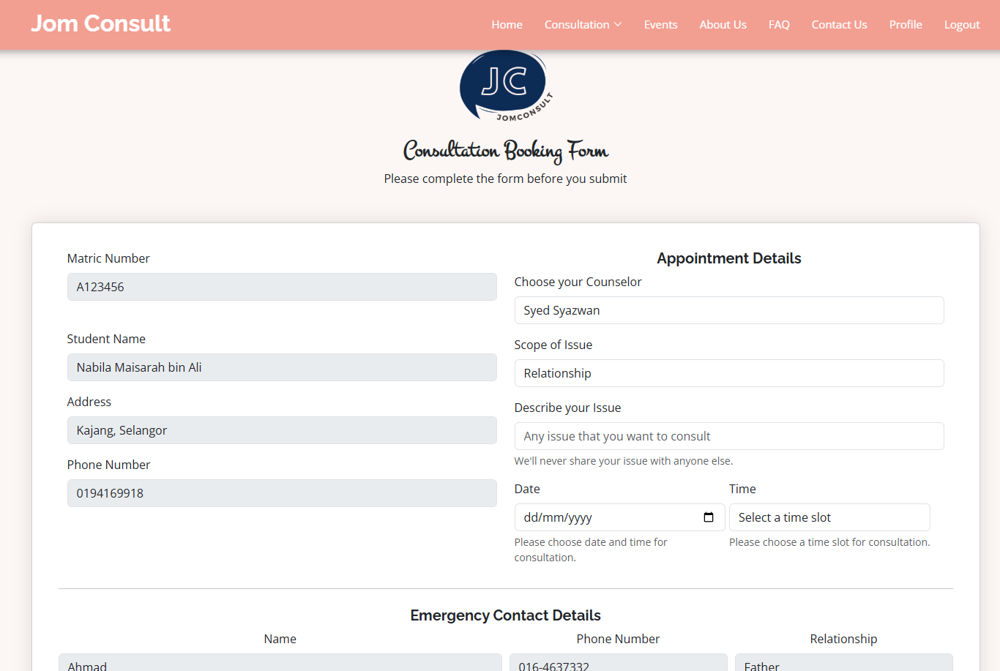
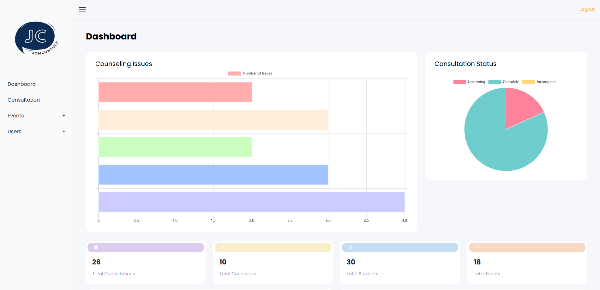
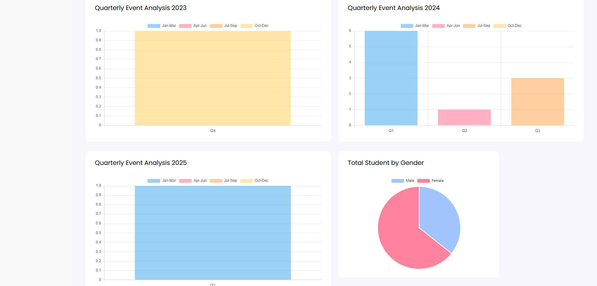

# JomConsult Counselling Booking System

JomConsult is a web-based counselling management system developed as a university team project. The system was designed to streamline counselling appointment scheduling and communication between students, counsellors, and administrators.

## Project Information

- Project Type: University Software Engineering Course Project
- Team Size: 5 Members
- Development Methodology: Software Development Life Cycle (SDLC)
  
## Technologies Used

* PHP
* JavaScript
* HTML
* CSS
* MySQL
* phpMyAdmin
* XAMPP
  
## Features

### Student Portal

* Student profile management
* Counselling appointment booking
* Appointment status tracking
* Access to counselling records and information

### Counsellor Portal

* Counsellor profile management
* Appointment scheduling and management
* Student appointment review
* Counselling session management

### Administrator Portal

* User account management
* Student and counsellor administration
* System monitoring and maintenance
* Appointment and record oversight

## Screenshots

### Login Page

### Student Dashboard

### Student Appointment Booking

### Counsellor Dashboard

### Admin Dashboard

## Development Approach

The project was developed following the Software Development Life Cycle (SDLC), including requirements gathering, system design, implementation, testing, and validation. The system uses a database-driven architecture to manage users, appointments, and counselling records.

## My Contributions

As part of a 5-member development team, I played a major role in the design and implementation of the system.

My contributions included:

* Developing the majority of the user interface using HTML, CSS, Bootstrap, and JavaScript
* Designing and implementing dashboard pages for students, counsellors, and administrators
* Implementing application functionality and business logic using PHP
* Developing user authentication, login, and role-based access control features
* Integrating frontend and backend components
* Assisting with database design and integration using MySQL and phpMyAdmin
* Implementing email notification functionality
* Performing testing, debugging, and feature validation
* Collaborating with team members throughout requirements analysis, development, and deployment

